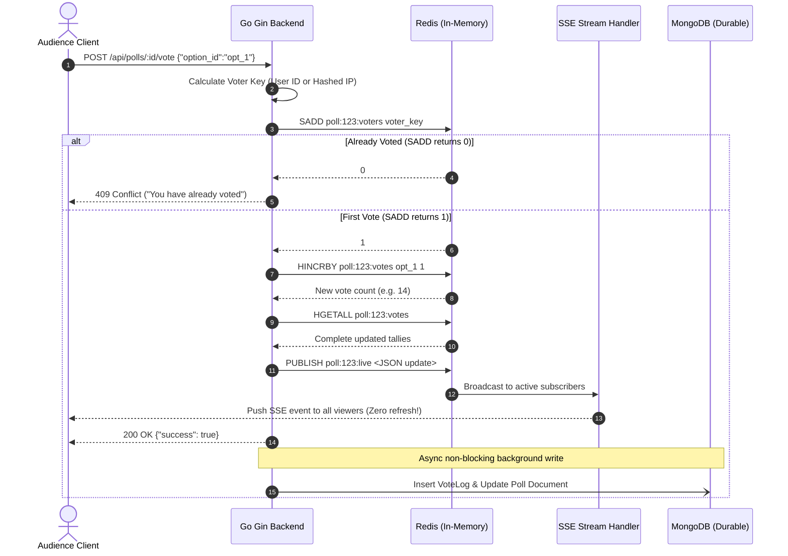

# Vote Handler Documentation (`backend/handlers/vote.go`)

## 1. What does `handlers/vote.go` do?
`vote.go` is the core high-throughput engine of the entire application. It processes votes submitted by audience members (`POST /api/polls/:id/vote`). It performs voter identity verification, executes atomic vote increments in Redis, publishes real-time vote updates to Redis Pub/Sub channels, and asynchronously persists vote records to MongoDB.

---

## 2. Why is it used?
In a live polling application, hundreds of audience members may click a vote option simultaneously during a live presentation.
- If we used standard relational database updates (`UPDATE options SET votes = votes + 1 WHERE id = ...`) or read-modify-write loops in MongoDB, database row locking or race conditions would result in lost votes and server lag.
- By delegating the hot write path to **Redis atomic commands (`HINCRBY` and `SADD`)**, we achieve sub-millisecond execution and total concurrency safety.

---

## 3. High-Concurrency Concepts & Redis Mechanics

### A. Preventing Race Conditions with `HINCRBY`
- When two requests execute concurrently:
  - **Unsafe Read-Modify-Write:** Both threads read `count = 5`, both calculate `5 + 1 = 6`, both write `count = 6`. One vote is permanently lost!
  - **Redis Atomic Command:** Redis processes commands on a single-threaded event loop. `HINCRBY poll:123:votes opt_1 1` executes atomically. Request A increments to `6`, Request B increments to `7`. Zero race conditions!

### B. Atomic Duplicate Prevention with Redis Sets (`SADD`)
- Redis Sets store unique strings.
- Command: `SADD poll:<id>:voters <voter_key>`
- `SADD` returns:
  - `1`: The voter key is new and was added to the set. Vote allowed!
  - `0`: The voter key was already in the set. Double-voting detected!
- This gives **O(1) time complexity** deduplication in memory without querying disk databases.

### C. Voter Identification Strategy (Logged-in vs Anonymous)
- **Logged-in Users:** Voter key = `user:<UserID>`.
- **Anonymous Guests:** Voter key = `ip:<SHA256(ClientIP)>`.
  - Privacy compliance: We hash the IP address with a salt so raw user IP addresses are never permanently retained in plain text.

---

## 4. The Complete Vote Lifecycle



---

## 5. Code Breakdown & Internal Mechanics

```go
func CastVote(c *gin.Context)
```
1. **Poll Status Check:** Verifies that the poll exists and `IsActive == true`.
2. **Voter Hash Generation:**
   ```go
   var voterKey string
   if userID, exists := c.Get("userID"); exists {
       voterKey = "user:" + userID.(string)
   } else {
       clientIP := c.ClientIP()
       hasher := sha256.New()
       hasher.Write([]byte(clientIP + "_salt"))
       voterKey = "ip:" + hex.EncodeToString(hasher.Sum(nil))
   }
   ```
3. **Atomic SADD Check:**
   ```go
   added, err := db.RedisClient.SAdd(ctx, "poll:"+pollID+":voters", voterKey).Result()
   if err != nil {
       c.JSON(http.StatusInternalServerError, gin.H{"error": "Failed to verify voter"})
       return
   }
   if added == 0 {
       c.JSON(http.StatusConflict, gin.H{"error": "You have already voted in this poll"})
       return
   }
   ```
4. **Atomic `HIncrBy` Counter:**
   ```go
   _, err = db.RedisClient.HIncrBy(ctx, "poll:"+pollID+":votes", input.OptionID, 1).Result()
   ```
5. **Publish to Redis Pub/Sub:**
   ```go
   // Fetch latest snapshot of all options
   allVotes, _ := db.RedisClient.HGetAll(ctx, "poll:"+pollID+":votes").Result()
   // Format payload and publish
   db.RedisClient.Publish(ctx, "poll:"+pollID+":live", payloadJSON)
   ```
6. **Asynchronous MongoDB Persistence:**
   ```go
   go func() {
       // Goroutine writes audit log to MongoDB without delaying HTTP response to user
       persistVoteToMongo(pollID, input.OptionID, voterKey)
   }()
   ```
